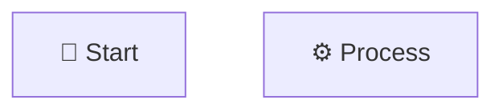

# 📊 QUICK REFERENCE - DIAGRAMS

## 🎯 Các file Diagram có sẵn

| File | Loại | Mô tả | Dùng cho |
|------|------|-------|----------|
| `order-flow.mmd` | Flowchart | Luồng xử lý tổng quan | Overview, Presentation |
| `architecture.mmd` | Component | Kiến trúc hệ thống | Technical docs |
| `sequence-payment.mmd` | Sequence | Thanh toán thành công | Demo success case |
| `sequence-auto-cancel.mmd` | Sequence | Tự động hủy | Demo timeout case |
| `state-diagram.mmd` | State | State machine | Technical design |
| `timeline.mmd` | Timeline | Vòng đời đơn hàng | Timeline demo |
| `rabbitmq-config.mmd` | Graph | Cấu hình RabbitMQ | Technical setup |

## ⚡ Quick Start - 3 bước

### 1️⃣ XEM ONLINE (NHANH NHẤT)

```bash
# Mở file trong GitHub
# GitHub tự động render Mermaid diagrams
https://github.com/tranchiencongtd/rabbitmq-spring-boot/tree/main/diagrams
```

### 2️⃣ EDIT & PREVIEW

```
1. Mở https://mermaid.live
2. Copy code từ file .mmd
3. Paste vào editor
4. Xem kết quả real-time
```

### 3️⃣ EXPORT ẢNH

```
Trên Mermaid Live:
Actions → Export → PNG/SVG/PDF
```

## 🎨 Top 5 Nền tảng sử dụng

| Nền tảng | Link | Ưu điểm |
|----------|------|---------|
| **GitHub** ⭐ | github.com | Tự render, version control |
| **Mermaid Live** | mermaid.live | Edit online, export ảnh |
| **Draw.io** | app.diagrams.net | Nhiều tùy chỉnh |
| **Notion** | notion.so | Tích hợp docs |
| **VS Code** | + Extension | Preview local |

## 📱 Sử dụng trong...

### PowerPoint / Google Slides
```
1. mermaid.live → Export PNG (3x)
2. Insert vào slide
✅ High quality
```

### Documentation (Confluence, Notion)
```
1. Upload PNG
2. Hoặc embed Mermaid code
✅ Easy to update
```

### Blog / Website
```
1. Export SVG
2. 
✅ Responsive, scalable
```

### GitHub README
```markdown
```mermaid
[paste code here]
```
✅ Auto-render
```

## 🔧 CLI Commands (Optional)

```bash
# Install Mermaid CLI
npm install -g @mermaid-js/mermaid-cli

# Export single file
mmdc -i order-flow.mmd -o order-flow.png

# Export all files
mmdc -i *.mmd -o ../images/

# High resolution PNG
mmdc -i order-flow.mmd -o order-flow.png -w 2000
```

## 💡 Pro Tips

### Tip 1: Custom Colors
```mermaid
style NodeName fill:#4f46e5,color:#fff
```

### Tip 2: Add Icons


### Tip 3: Share Link
```
1. Paste code in mermaid.live
2. Click "Share"
3. Copy URL
4. Send to team
```

## 🎯 Khuyến nghị

| Tình huống | Nên dùng | Lý do |
|------------|----------|-------|
| Presentation | PNG (3x) | Chất lượng cao |
| Documentation | GitHub Markdown | Version control |
| Website | SVG | Responsive |
| Print | PDF | Vector quality |
| Quick share | Mermaid Live link | No setup |

## 🆘 Troubleshooting

**Q: Không render được?**
```
A: Check syntax tại mermaid.live
```

**Q: Ảnh bị mờ?**
```
A: Export PNG với resolution cao hơn (2x, 3x)
```

**Q: Cần edit sau?**
```
A: Lưu file .mmd, edit text, re-export
```

## 📞 Support

**Documentation:** [diagrams/README.md](README.md)

**Mermaid Docs:** https://mermaid.js.org

**Live Editor:** https://mermaid.live

---

**💡 Remember:** Diagrams = Code. Easy to version, easy to update! 🚀
