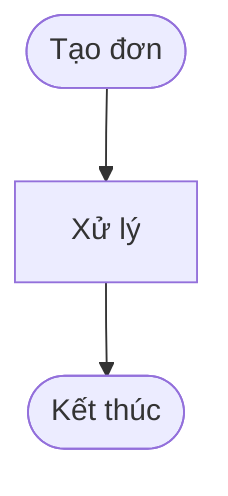
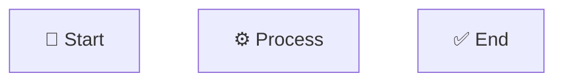

# 📊 HƯỚNG DẪN SỬ DỤNG DIAGRAMS

## 📁 Danh sách Diagrams đã tạo

Tôi đã tạo **7 diagram files** ở định dạng Mermaid (`.mmd`):

### 1. **order-flow.mmd** - Luồng xử lý đơn hàng
Flowchart tổng quan về toàn bộ luồng từ tạo đơn → thanh toán/hủy

### 2. **sequence-payment.mmd** - Sequence thanh toán thành công
Sequence diagram cho scenario thanh toán thành công

### 3. **sequence-auto-cancel.mmd** - Sequence tự động hủy
Sequence diagram cho scenario tự động hủy sau timeout

### 4. **architecture.mmd** - Kiến trúc hệ thống
Component diagram hiển thị các layer và components

### 5. **state-diagram.mmd** - State machine
State diagram cho các trạng thái đơn hàng

### 6. **timeline.mmd** - Timeline vòng đời đơn hàng
Timeline diagram theo thời gian thực

### 7. **rabbitmq-config.mmd** - Cấu hình RabbitMQ
Chi tiết exchanges, queues, bindings

---

## 🌐 CÁCH SỬ DỤNG - 5 NỀN TẢNG PHỔ BIẾN

### 1️⃣ GitHub / GitLab (Khuyên dùng! ⭐)

**Cách 1: Trực tiếp trong Markdown**
```markdown
# Luồng xử lý đơn hàng


```

**Cách 2: Import file**
- Commit các file `.mmd` vào repo
- Trong README.md, viết:
```markdown

```

**✅ Ưu điểm:**
- Tự động render, không cần công cụ
- Version control
- Dễ review trong PR

**🔗 Demo GitHub:** https://github.com/tranchiencongtd/rabbitmq-spring-boot

---

### 2️⃣ Mermaid Live Editor (Xem và Chỉnh sửa)

**Website:** https://mermaid.live

**Cách dùng:**
1. Mở https://mermaid.live
2. Copy nội dung từ file `.mmd`
3. Paste vào editor bên trái
4. Xem kết quả bên phải real-time

**Xuất file:**
- Click "Actions" → Export
- Chọn format: PNG, SVG, PDF
- Download về máy

**✅ Ưu điểm:**
- Real-time preview
- Edit trực tuyến
- Xuất nhiều format
- Share link

**💾 Lưu link:**
- Click "Share" để tạo link
- Link chứa toàn bộ diagram code

---

### 3️⃣ Draw.io / diagrams.net (Chuyển đổi)

**Website:** https://app.diagrams.net

**Cách dùng:**
1. Mở https://app.diagrams.net
2. File → Import from → Text
3. Paste Mermaid code
4. Draw.io sẽ convert sang visual diagram

**Xuất file:**
- File → Export as → PNG/SVG/PDF
- Hoặc lưu định dạng `.drawio` để edit sau

**✅ Ưu điểm:**
- Nhiều tùy chỉnh visual
- Xuất nhiều format
- Offline mode (Desktop app)

---

### 4️⃣ Notion (Documentation)

**Cách dùng:**
1. Tạo page trong Notion
2. Gõ `/code` → Chọn Code block
3. Chọn language: `Mermaid`
4. Paste code từ file `.mmd`

**Hoặc:**
1. Xuất diagram thành PNG từ Mermaid Live
2. Upload ảnh vào Notion
3. Add caption

**✅ Ưu điểm:**
- Tích hợp trong documentation
- Dễ share với team
- Version history

---

### 5️⃣ Visual Studio Code (Preview local)

**Extension:** Markdown Preview Mermaid Support

**Cài đặt:**
```
Ctrl + Shift + X → Search "Mermaid"
Install: "Markdown Preview Mermaid Support"
```

**Cách dùng:**
1. Tạo file `README.md`
2. Viết:
```markdown
```mermaid
[paste code here]
```
```
3. Ctrl + Shift + V → Preview

**✅ Ưu điểm:**
- Preview ngay trong VSCode
- Không cần internet
- Edit và preview cùng lúc

---

## 🎨 XUẤT DIAGRAM THÀNH ẢNH

### Phương pháp 1: Mermaid CLI (Khuyên dùng cho automation)

**Cài đặt:**
```bash
npm install -g @mermaid-js/mermaid-cli
```

**Sử dụng:**
```bash
# Xuất thành PNG
mmdc -i diagrams/order-flow.mmd -o images/order-flow.png

# Xuất thành SVG
mmdc -i diagrams/order-flow.mmd -o images/order-flow.svg

# Xuất tất cả
mmdc -i diagrams/*.mmd -o images/
```

**✅ Ưu điểm:**
- Automation trong CI/CD
- Batch processing
- High quality output

---

### Phương pháp 2: Mermaid Live Editor

1. Mở https://mermaid.live
2. Paste code
3. Click "Actions" → "Download PNG/SVG"

**Resolution:**
- PNG: High resolution (2x, 3x)
- SVG: Vector (infinite zoom)

---

### Phương pháp 3: Browser Screenshot

1. Mở file `.mmd` trên GitHub
2. GitHub tự render
3. Screenshot (Windows: Win + Shift + S)
4. Crop và lưu

---

## 📝 CHỈNH SỬA DIAGRAMS

### Thay đổi màu sắc


### Thay đổi hướng

```mermaid
flowchart LR  %% Left to Right
flowchart TD  %% Top to Down
flowchart BT  %% Bottom to Top
```

### Thêm icons



---

## 🎯 KHUYẾN NGHỊ SỬ DỤNG

### Cho Presentation (PowerPoint, Google Slides):
1. Mermaid Live → Export PNG (3x resolution)
2. Insert vào slide
3. ✅ Chất lượng cao, sắc nét

### Cho Documentation (Confluence, Notion):
1. GitHub Markdown với Mermaid code
2. Hoặc upload PNG
3. ✅ Dễ update, version control

### Cho Blog/Website:
1. Export SVG từ Mermaid Live
2. Embed SVG vào HTML
3. ✅ Responsive, load nhanh

### Cho Paper/Report (Word, PDF):
1. Export PDF từ Mermaid Live
2. Insert vào document
3. ✅ Vector quality, print tốt

---

## 🔗 DEMO LINKS

### Xem trực tuyến (Mermaid Live):

**Order Flow:**
```
https://mermaid.live/edit#pako:eNp...
[Paste code vào để tạo link]
```

**Quick access:**
1. Mở https://mermaid.live
2. Paste code từ file `.mmd`
3. Copy URL từ address bar
4. Share URL này với team

---

## 💡 TIPS & TRICKS

### 1. Version Control
```bash
# Commit diagrams cùng với code
git add diagrams/*.mmd
git commit -m "Add architecture diagrams"
```

### 2. Auto-generate trong CI/CD
```yaml
# .github/workflows/diagrams.yml
- name: Generate diagrams
  run: |
    npm install -g @mermaid-js/mermaid-cli
    mmdc -i diagrams/*.mmd -o docs/images/
```

### 3. Link trong README
```markdown
## Diagrams

- [Luồng xử lý](./diagrams/order-flow.mmd)
- [Architecture](./diagrams/architecture.mmd)
```

---

## 🎨 CÁC NỀN TẢNG KHÁC

### Diagrams.net (Draw.io)
- **URL:** https://app.diagrams.net
- **Import:** File → Import from → Text (Mermaid)
- **Xuất:** PNG, SVG, PDF, XML

### PlantUML
- Convert Mermaid → PlantUML
- **Tool:** https://mermaid-to-plantuml.vercel.app

### Lucidchart
- Import Mermaid code
- **URL:** https://www.lucidchart.com

### Whimsical
- Visual collaboration
- **URL:** https://whimsical.com

### Excalidraw
- Hand-drawn style
- **URL:** https://excalidraw.com

---

## 📚 TÀI LIỆU THAM KHẢO

### Mermaid Documentation
- **Website:** https://mermaid.js.org
- **Syntax:** https://mermaid.js.org/intro/syntax-reference.html
- **Examples:** https://mermaid.js.org/ecosystem/integrations.html

### Tutorials
- **YouTube:** Search "Mermaid diagram tutorial"
- **GitHub:** https://github.com/mermaid-js/mermaid

---

## ✅ CHECKLIST SỬ DỤNG

Để sử dụng diagrams trong presentation/documentation:

- [ ] Chọn nền tảng phù hợp (GitHub/Mermaid Live/Draw.io)
- [ ] Copy code từ file `.mmd` tương ứng
- [ ] Preview diagram
- [ ] Chỉnh sửa nếu cần (màu sắc, text, layout)
- [ ] Export format phù hợp (PNG/SVG/PDF)
- [ ] Embed vào document/presentation
- [ ] Test trên thiết bị khác nhau
- [ ] Share link nếu cần

---

## 🎉 KẾT LUẬN

Bạn có **7 diagrams chuyên nghiệp** sẵn sàng sử dụng:

✅ Flowchart tổng quan
✅ Sequence diagrams (2 scenarios)
✅ Architecture diagram
✅ State machine
✅ Timeline
✅ RabbitMQ configuration

**Khuyến nghị:**
- **GitHub/GitLab**: Tốt nhất cho version control
- **Mermaid Live**: Tốt nhất cho preview/share nhanh
- **PNG Export**: Tốt nhất cho presentation

**Good luck với presentation! 🚀**
